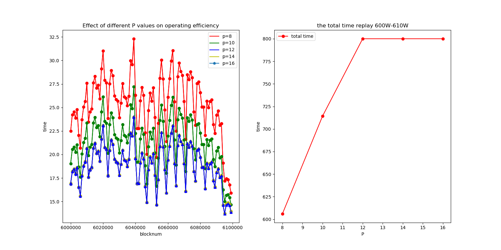

> 对于archive模式的全节点完整的跑一次区块大概需要14天([geth v1.9.0](https://blog.ethereum.org/2019/07/10/geth-v1-9-0/))对于重放合约获取数据该时间较长，并且geth客户端不能定点重放合约，因此需要编写geth-query重放合约工具，并且优化该工具的运行效率。

1. 对需要重放的区块数量平均分成cpu逻辑内核的份数，然后每一份启动一个协程开始重放区块数据。

2. 构建一个协程池，协程池内的协程数目为cpu的核数，然后定义一个batchBlockNum，每次向协程池中的空余协程投放batchBlockNum个block。因为每一个协程都在大量读写磁盘，这里使用协程池限制协程数量主要是因为磁盘I/O的限制。这里的运行效率主要和batchBlockNum的大小(CPU计算量的大小)以及使用逻辑核数P的值有关。

对于思路1主要是在区块数据中，前面区块数据运行较快，后面区块数据运行慢。通过平分区块数量不能达到平分计算量的效果，因此会导致运行前面区块的协程早已运行完毕，运行后面区块的协程还在继续运行，并且此时CPU的逻辑核没有用完，导致CPU利用效率不高。

对于思路2，具体分析如下：

```bash
# 本机环境
cpu: K9900 8核16线程
mem: 32G
SSD:4T + 4T
```

首先将逻辑核数用满16核，三星阵列的读取速度最高位800M每秒左右。然后尝试使用12核发现三星阵列的读取速度也已经跑满，测试600W-610W的速度如下所示：

 

上面的图显示当P值12及12以上的时候，geth-query的执行效率提升不高，因此600W-610W的g的最优值为12

对于batchnum大小的衡量如下：


### 进一步工作

由于前面的block世界状态大小较小，对于磁盘读写压力较小，猜想对于前面的块较高P值能够适当提升geth-query执行前面区块的执行效率。


### 实验数据

逻辑核数和协程数对geth-query重放工具的影响，这里的速度是三星SSD硬盘接近满载的geth-query的速度：

1月10(三星SSD80%)

| 参数          | 核数-协程数 | 时间    |
| ------------- | ----------- | ------- |
|               | 8-16        | 2h45m   |
| 600-610W-1000 | 10-16       | 2h20m   |
| ...           | 12-16       | 2h5m7s  |
|               | 14-16       | 2h5m23s |
|               | 16-16       | 2h5m19s |
|               |             |         |


1月20(三星SSD97%)

| 参数          | 核数-协程数 | 时间  |
| ------------- | ----------- | ----- |
| 600-610W-1000 | 12-8        | 4h21m |
|               | 12-12       | 2h44m |
|               | 12-16       | 2h32m |
|               | 12-24       | 2h38m |
|               | 12-36       | 2h38m |
|               |             |       |

1月21(三星SSD97%)

| 参数          | 核数-协程数 | 时间  |
| ------------- | ----------- | ----- |
| 600-610W-1000 | 8-4         | 6h26m |
|               | 12-16       | 2h45m |
|               | 12-24       | 2h49m |
|               | 12-36       | 3h4m  |
|               | 16-16       | 2h34m |
|               | 16-32       | 2h48m |
|               | 16-64       | 2h44m |
|               |             |       |
|               |             |       |


[3]"ethereum/wiki",GitHub,2019.[Online].Available:
https://github.com/ethereum/wiki/wiki/White-Paper.

[4] Communication and Networks
(ICCCN) (pp. 1-6). IEEE.En.wikipedia.org. (2019). https://en.wikipedia.org/wiki/The_DAO_(organization)
[Accessed 13 Dec. 2019].

[5]陈伟利,郑子彬.区块链数据分析:现状、趋势与挑战[J].计算机研究与发展,2018,55(09):1853-1870.

[6] Chen, W., Zheng, Z., Cui,J., Ngai, E., Zheng, P., & Zhou, Y. (2018, April). Detecting ponzi schemes on ethereum: Towards healthier blockchain technology. In Proceedings of the 2018 World Wide Web Conference (pp. 1409-1418). International World Wide Web Conferences Steering Committee.

[7] Norvill, R., Pontiveros,B. B. F., State, R., Awan, I., & Cullen, A. (2017, July). Automated labeling of unknown contracts in ethereum. In 2017 26th International Conference on Computer.

[8] Tikhomirov, S., Voskresenskaya, E., Ivanitskiy, I., Takhaviev, R., Marchenko, E., & Alexandrov, Y. (2018, May). Smartcheck: Static analysis of ethereum smart contracts.
In 2018 IEEE/ACM 1st International Workshop on Emerging Trends in Software Engineering for Blockchain (WETSEB) (pp. 9-16). IEEE.

[9] Etherscan,(2019).[online]Available: https://etherscan.io/ [Accessed 13 Dec. 2019].

[10] Blockchair.com. (2019). Blockchair — Universal blockchain explorer and search engine. [online] Available at: https://blockchair.com/ [Accessed 13 Dec. 2019].