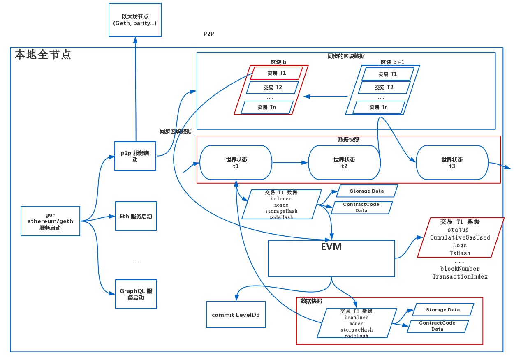
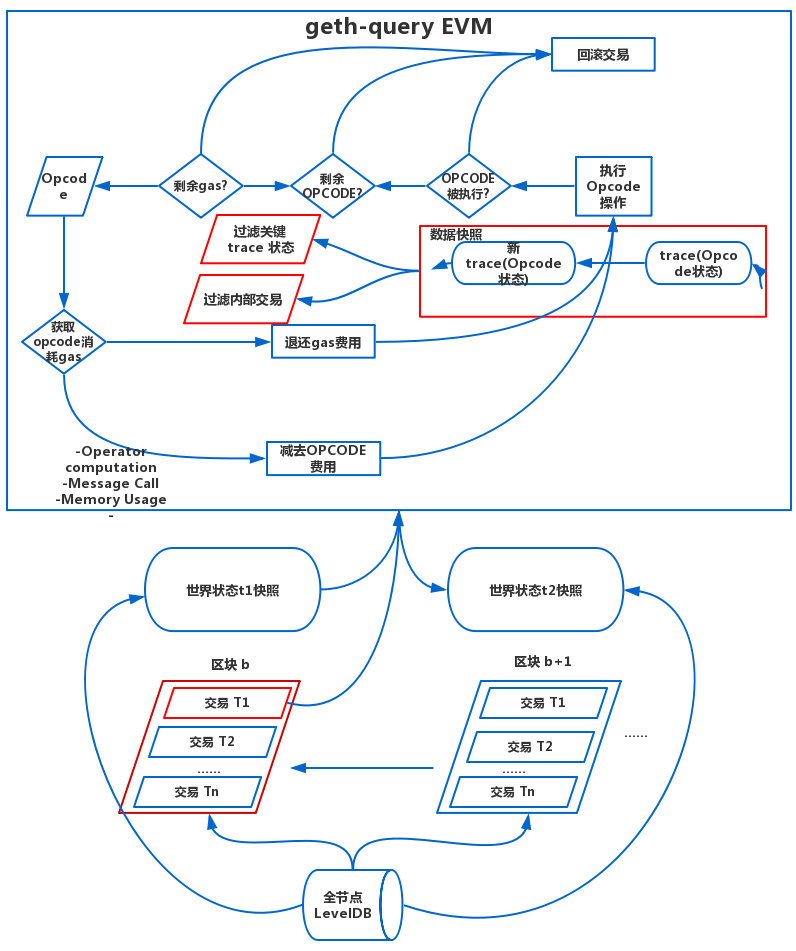
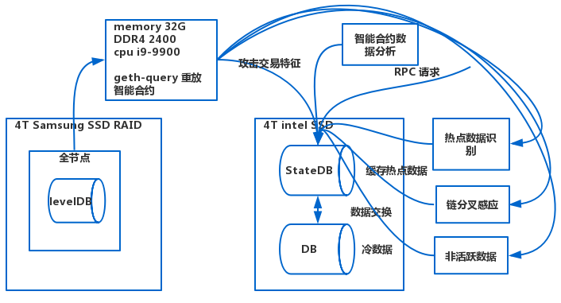

## 以太坊智能合约数据高速抽取和重放

为了解决从海量的区块数据中快速提取智能合约运行特征，本文提出智能合约数据快速抽取和重放技术。解决以太坊从海量区块数据中抽取合约运行状态难和利用合约运行状态实时监控合约状态难的问题。主要的分为以下几个部分：

1. 智能合约状态的自动抽取。智能
2. 合约再链上执行过程中，每一个状态都有可能导致其世界状态的变化。在同步区块数据时，通过适当保存合约运行的中间状态，能够实现智能合约的定点重放。
3. 智能合约执行过程的快速重放。通过优化本地的EVM，更改EVM的内部结构，通过EVM快速重发智能合约以及抽取合约运行特征。
4. 面向区块链的同步缓存技术。通过存储智能合约重发运行特征以及区块数据，并且提供高效的外部查询接口。

### 智能合约状态的自动抽取

智能合于运行在区块链虚拟环境中，不存在直观的标准化接口能够访问合约中的各类状态。事实上，单一合约状态的变化会影响整个区块链状态的变化，而且这种变化会随着区块高度和交易数量而不断增加，甚至随着合约代码的逐步调用执行而时刻发生变化。例如，合约的单步执行即可导致自身状态变化，或导致多个账户余额更改，或导致其他合约的状态发生变化。因此为了快速定位需要的信息，高效筛选合约状态至关重要，本部分通过对智能合约特性深入分析，筛选出不同维度的链上信息进行处理和快照，如区块，交易，收据，事件日志，合约基本全貌信息，特定类型合约信息，合约内部调用记录，合约逐步调用轨迹等。这些信息从粗至细记录了合约在链上的所有状态，可以满足不同场景下的分析需求。

智能合约数据抽取过程具体如下：

1. 通过以太坊Geth客户端启动全节点，全节点会启动一系列服务，P2P服务从其他以太坊全节点通过P2P连接同步区块数据到内存。
2. Geth客户端按区块顺序遍历执行每个区块和区块中的每一笔交易，在执行过程中快照保存每个区块的世界状态和智能合约数据存储的中间状态，便于通过快照状态重放智能合约。
3. 每笔交易的执行会对应一个新的EVM虚拟机，EVM虚拟机通过合约账户的code域按顺序读取智能合约的opcode指令执行，快照保存指定opcode执行状态，通过执行opcode识别内部交易，保存内部交易数据。
4. 交易执行结束，保存交易数据，以及交易返回的票据数据。
5. 区块执行结束，保存区块数据，向底层levelDB数据库commit数据更新。
6. 重复上述操作，直至全节点跟上主网的同步状态。

另一方面，合约状态和区块交易中还包含大量冗余信息，对长期数据存储同步以及后续分析带来极大的压力，后面会对数据使用颗粒化快照策略，对这部分信息进行过滤。

### 智能合约执行过程重放优化

针对智能合约依赖特定运行环境以及合约状态时间依赖问题，本文研究合约任意状态恢复，合约虚拟机跟踪调试，合约运行资源消耗复原。

智能合约和区块链本质上是一个状态机系统，智能合约的逐步执行造成状态的改变和转移。本文通过记录区块链每个区块下的状态，以及在交易维度下的每次状态差异，实现最小代价维护整个区块链系统的关键状态转移信息。另外，通过索引每个交易trace和交易内的虚拟机执行trace,保留最精细的执行过程信息。这种设计下，可以实现以下多维度的执行过程重发：任意区块内的所有交易执行重放；任意交易的执行过程重放；任意合约执行过程中虚拟机状态重放。前面提到记录的每次状态差异即可用于快速对比合约执行效果，也用于高效复原任意节点的完整合约状态。最终通过此套方案快速恢复智能合约在历史上任意时刻的状态。并且由于对EVM进行了优化，通过过滤关键的trace信息和去除交易执行完后向底层数据库LevelDB的写操作，能够极大加快EVM重放交易的速度。智能合约执行过程重发执行步骤主要如下：

1. 启动智能合约重放工具Geth-query,Geth-query服务读取全节点数据库LevelDB中的区块数据和区块世界状态快照，恢复重放区块或交易的世界状态。

2. Geth-query服务按区块顺序遍历执行每个区块和区块中的每一笔交易，通过对每一笔交易都新建一个EVM虚拟机开始执行交易。

3. EVM虚拟机通过合约账户的code域按顺序读取智能合约的opcode指令执行，快照保存指定opcode执行状态，通过执行opcode识别内部交易，保存内部交易数据。

4. 所有交易执行结束，智能合约执行过程重放数据导出存储。

智能合约执行过程重放优化过程如下图所示:

智能合约在虚拟机中的运行过程包含重要信息，对于安全分析和监控尤为重要。在合约任意状态恢复技术的之处下，可复原任意时刻链上状态用于虚拟机跟踪调试，即可用于漏洞追溯分析和威胁检测。本技术还可对关键操作符进行识别，以获取更多核心数据，为后续分析提供尽可能多的深度元信息。

智能合约的运行模型中还有至关重要的资源机制，用于防止公共系统下的资源滥用。合约运行资源消耗是合约执行过程中的重要部分，同时也对安全分析以及程序质量优化有着重要意义。通过前期索引智能合约的每一步执行操作符，对应资源消耗和剩余情况，可对合约运行时资源进行完整复原，为资源消耗分析和优化建议提供全貌信息。

### 面向区块链的同步缓存技术

为了解决区块数据同步和利用过程中，所暴露出来的区别于传统应用数据同步的新问题，本文拟研究节点分叉处理，非活跃数据分离存储方案，热点地址识别策略，实时数据导出等问题。

区块量系统的基本单位是单一节点，作为分布式系统中的一员与其他节点进行通讯和数据交换。常见的区块链共识机制决定了节点分叉现象不可避免。本文拟研究节点分叉处理技术来处理数据同步时由于分叉带来的数据错位问题。通过建立双层同步缓存区，对于新同步的数据放入第一层缓存区，可供外部进行简单查询分析。当第一层缓存区中相关交易区块确认高度超过规定数值时，认为交易不会被逆转，则推送至第二层缓存区块进一步处理。当分叉发生后，分叉感知模块对第一层缓存区的数据进行更正。这样可以确保进入后续深度分析和持久化存储的数据可靠性。

区块链中还存在大量非活跃数据，如长期无交易记录的地址以及可能已经作废的智能合约。对于与这类地址相关的数据，本文实施非活跃数据分离存储方案，可以起到缩减核心数据库，提升整体查询分析性能的效果。相对的，对于活跃地址和合约，则优先缓存。具体热点地址识别对象包括：主流项目智能合约，近期热点智能合约，高价值智能合约，关键工具合约。同时，冷热地址会按照一定规则进行重新转换，以达到最高的数据缓存和存储性价比。区块链数据缓存技术主要步骤如下：

1. 启动智能合约重放工具Geth-query,Geth-query服务读取全节点数据库LevelDB中的区块数据和区块世界状态快照，恢复重放区块或交易的世界状态。

2. Geth-query重放智能合约执行过程，过滤虚拟机中特定trace的状态和内部交易，保留最精细的执行过程。

3. Geth-query重放智能合约执行过程完成，将获取的合约重放的颗粒快照数据导入各个分析模块进行分析处理。

4. 各个合约数据处理模块如：热点地址识别，节点分叉处理模块和非活跃数据分离等模块对合约重放数据进行处理，将处理过后的数据存入StateDB。

5. StateDB触发数据更新，与底层数据库进行冷热数据交换。

具体区块链数据缓存架构图如下所示:

 

为了满足针对区块链和智能合约的大量数据分析需求，本文研究实时数据导出技术，方便其他场景下的数据二次加工。本文通过更改区块链全节点的源代码，在区块链节点数据同步过程中，对于区块链数据进行实时导出。导出内容可以指定，从而满足不同场景下的需求。

### 工作优越性

完成上述研究后会将产生的结果和现有的全节点RPC接口以及全节点EVM运行速度相互对比，对比主要分为三个方面：

1. 对比本地EVM重放智能合约速度和全节点运行智能合约的速度。

2. 对比两者RPC请求响应速度，通过对比两者RPC请求响应速度来体现现有工作的优势。

3. 对比现有实验结果的RPC请求能够获取的数据而现有全节点的RPC请求不能获取的数据，体现现有工作的优势。比如智能合约运行过程中产生的特征。