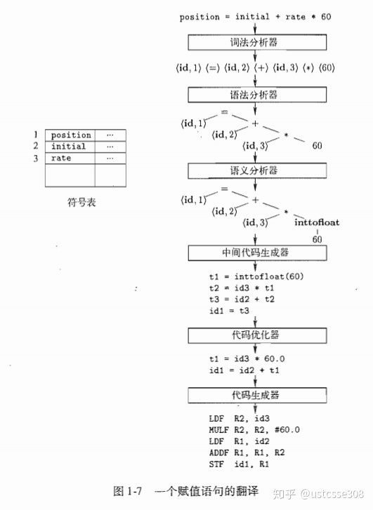

## flex 词法分析

```bash
扫描 (词法分析)
Parsing (语法分析)
类型检查 (语义分析)
中间代码生成
优化
代码生成
```



词法分析是编译器工作的第一步。词法分析负责将用户的代码从左至右依次读入，识别出来其中的词素（lexeme），并将词素映射为token（role）。

flex的语法和结构是什么样的呢？flex通过读取一个*.l或者*.lex文件里的单词匹配规则生成C语言的实现代码。一个*.l的文件里的结构大概如下，用%%分隔开来。

```text
%{ /*declaration*/ %} 
/* Definition */
%%
/* Rules */ 
%%
/* C Code */
```

- **定义区**包含一些简单的**名字定义**(name definitions)来简化词法**扫描器**(scanner)的规则，并且还有**起始条件**(start condition)的定义。
- **规则区**包含了一系列具有**pattern-action**形式的规则，并且模式 pattern 位于行首不能缩进，action 也应该起始于同一行。
- **用户代码区** 的代码将被原封不动地拷贝到输出文件中，并且这些代码通常会被扫描器调用，当然，该区是可选的，如果 Flex 源文件中不存在该区，那么可以省略第二个 "%%" 。

上面的例子中，只包括Rules和C代码两部分。第一部分的declaration因为代码太简单，没有。规则使用正则表达式给出；flex将它翻译成C代码，实现状态机。

flex工作过程

使用诸如Flex的词法生成器的好处是使得程序员可以集中考虑词法的特点；而不是具体如何实现词法分析。

```text
%%
[0-9]+  printf("?");
#       return 0;
.       ECHO;
%%
```

### flex工作原理

在词法分析中，最重要的语言上运算是并、连接和闭包运算。下面是运算的正规定义：


`?` 0或者1

`.`匹配任意

`*`0个或者多个

`+`1个或者多个

思考以下的问题：

**令L和D定义如下：L:** **{ A, B, …, Z, a, b, …, z },** **D: { 0, 1, …, 9 }**

**那么L** ![[公式]](https://www.zhihu.com/equation?tex=%5Ccup) **D、LD、** ![[公式]](https://www.zhihu.com/equation?tex=L%5E%7B6%7D) **、** **L\*,** **L(L** ![[公式]](https://www.zhihu.com/equation?tex=%5Ccup) **D )\*以及** ![[公式]](https://www.zhihu.com/equation?tex=D%5E%7B%2B%7D) 分别构造了什么语言？


在定义好正则表达式之后，怎么基于正则表达式构造代码来检查输入字符串，并返回和模式匹配的词素呢？

作为构造词法分析器的中间步骤，首先将模式转换为具有特定风格的流图，称为“状态转换图”。我们首先看看如何使用手工方法来构造，然后研究如何自动从正则表达式构造状态转换图。

状态转换图（transition diagram）有组称为状态（state）的节点或圆圈，图中还包括有向边，每条边上面有一个或多个标号，代表从一个状态转到另一个状态的条件。转换图的每一个状态代表了词法分析器扫描输入串的过程中可能遇到的情况。