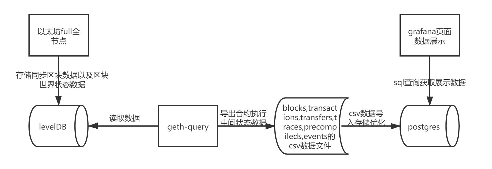
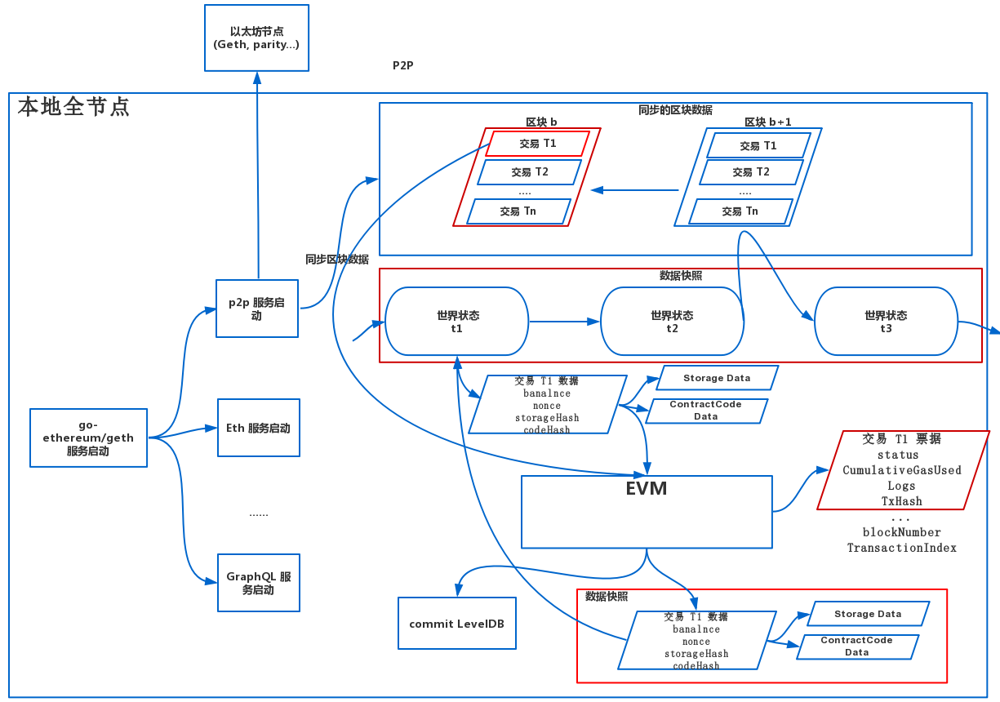
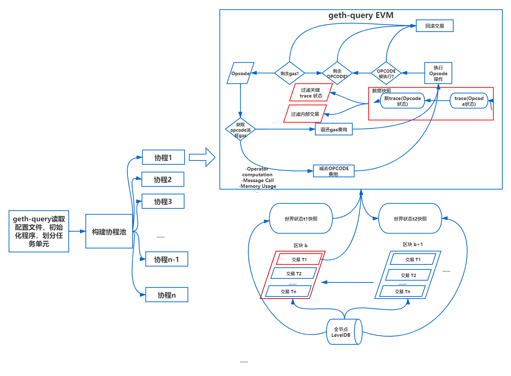
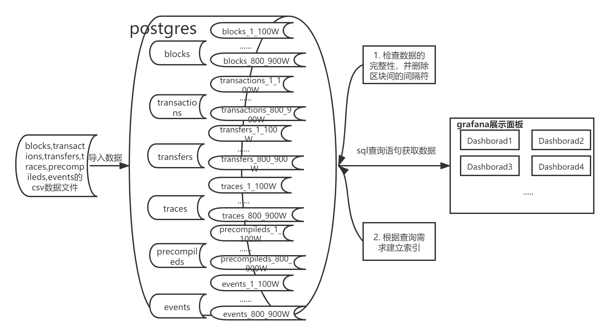
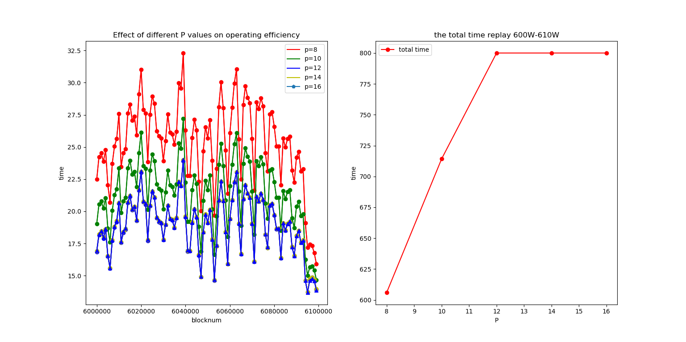
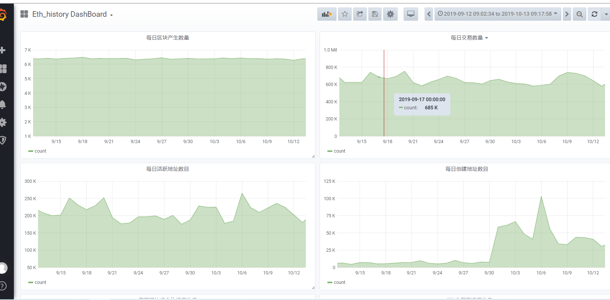

# 以太坊智能合约数据高速抽取和重放

> 以太坊作为主要的区块链平台，运行着大量的智能合约。随着合约数量的快速增加，安全问题也日益突出，黑客利用合约中的各种漏洞获得了大量非法收益，智能合约的安全分析日益重要。对智能合约的安全检测，不仅需要对合约字节码进行静态检测，更重要的是结合合约运行过程的特征进行分析。而提取合约运行过程中的特征，需要从海量区块数据中重放合约的运行过程来实现。为了实现合约的快速定点重放并记录运行过程。本文提出了以太坊数据快速抽取和重放的方法，通过自定义抽取合约运行中间状态数据和优化本地EVM运行过程，达到通过任意点快速执行交易和提取合约执行中间状态的目的，从而为通过合约运行特征分析合约安全提供可能。本文实现了智能合约状态自动抽取，从而实现合约的定点重放；以及面向区块链的数据缓存同步，提供了高效查询的外部接口。从而为智能合约的安全分析提供了数据基础。
>
> 通过上述工作研究出的geth-query工具能够实现合约快速定点重放以及合约执行过程中间数据自定义抽取，对自定义抽取数据搭建了数据展示网站，验证了整个系统的可用性。http://secbit.ddns.net:30000/
> 
> **keyword**
>
> 以太坊   智能合约数据抽取  合约重放

[TOC]

## 介绍

自从2008年中本聪提出比特币区块链以来，由于其优秀的去中心化、交易可追溯等特性，区块链技术得到了快速发展。区块链是由多种技术组合而成，密码学，共识机制[2]，点对点传输，分布式账本等等。区块链通过融合这些技术来解决系统中每个个体之间的信任问题，其本质就是通过数学运算作为保障来降低人类的信任成本。

以太坊[3]是在比特币基础上发展而来的新型区块链系统，被称为区块链2.0，它创新性在区块链平台上引入了智能合约的概念，由于智能合约具有图灵完备性，从而可以以太坊平台上开发各种去中心化应用，例如去中心化交易所(loopring)，游戏合约(加密猫,我的加密英雄)，交易所(MakerDAO)，博彩(Femo3D)，ICO(The DAO)等等。随着以太坊平台智能合约数量的快速增长，也出现了一系列合约安全性问题。例如2016年6月，以太坊最大众筹项目The DAO[11]被攻击，直接经济损失超过10亿美元，以太坊市值大跌，因此智能合约安全分析具有重大意义。

当前，主要是使用静态分析的分析方法对智能合约的字节码进行分析。例如首先反编译合约字节码，通过逻辑符号构造智能合约，然后通过对合约的抽象语法树和控制流图以及使用约束求解器求解合约程序运行路径等方式分析合约安全问题。虽然智能合约通过静态分析能过在一定程度上发现合约安全问题，但是不能分析合约安全的全貌，往往需要结合合约的运行情况深入分析。另一方面，区块链上的合约产生速度快，新的安全事件层出不穷，为了保证安全漏洞的检出率，需要实时监控并分析链上的合约，从而收集最新的安全信息和被攻击合约特征。这需要能够以高效、快速的方式从区块链导出合约的代码与合约相关的历史状态。

以etherscan为代表的第三方区块链浏览器，虽然可以使得用户能够在不运行一个全节点的情况下轻松获取区块数据，但是并没有智能合约完整的中间状态数据，导致不能满足一些专业数据分析人员的需求，譬如不能查询一笔历史交易执行前的“世界状态”，也不能查询历史合约交易的所有traces，即每个opcode执行时的记录。以谷歌提供的以太坊数据查询和分析工具虽然能够向开启Debug模式的全节点请求批量数据，但是大部分的全节点都不支持开启Debug模式和支持批量RPC数据请求。而BigQuery并不能实现批量查询，主要的原因在于用户请求一个区块的所有receipts时，原始的区块数据需要从磁盘中读取到内存中运行，解析出所有的receipts返回给用户，因此该工具在获取交易receipts时速度很慢。

因此，现有的以太坊区块链数据平台存在数据量不足、数据不够精细、数据访问慢等各种问题。为了解决上述问题，满足智能合约安全性分析的需求，需要一种高效快速地从区块链导出合约的代码以及合约相关的历史状态的方法。本文通过分析区块链底层数据库，直接通过全节点快速将区块数据和合约字节码导出，并且可以通过高速重放技术，可以将合约的攻击行为进行重放，并且通过监控事件获取最新的漏洞合约的运行特征。

我们提出了geth-query区块链数据导出工具，使用该工具重放了9000000个以太坊的区块，导出了1.6T的原始区块链数据，该数据主要分为6个部分1. 区块数据，2. 交易数据，3. 内部交易数据，4. 交易trace数据，5. 交易event数据，6. 预编译合约调用数据。然后我们对导出数据进行了存储优化，为用户提供了数据可视化工具。

总的来说，本文的主要贡献如下：

1. geth-query工具能够自定义导出数据种类。我们通过修改go-ethereum的源代码，在以太坊虚拟机中增加数据捕获模块代码，能够自定义捕获交易在EVM中执行的中间数据。
2. geth-query工具提升了区块链数据导出速度。我们通过以太坊full节点的archive模式保存每个区块的历史世界状态，实现geth-query工具定点并行重放区块，优化geth-query工具的并行参数，最大限度利用本机资源，加快区块数据导出速度。
3. 我们对geth-query工具导出的数据进行了存储优化，并且搭建了可视化的网站。

## 背景

以太坊是全球去中心化并且开源的计算基础架构，被称为下一代去中心化计算机。相比与比特币，以太坊的主要不表不是成为数字货币的支付网络，虽然以太坊存在以太币，但是其目的是作为一种效用货币来支付以太坊这个“世界计算机”产生的花费，避免以太坊图灵完备的智能合约运行过程中产生的"停机问题"。以太坊的设计目标是一个图灵完备的通用目的的区块链，它将智能合约的代码加载进入状态机，然后运行这些代码，并且把状态转换产生的结果保存到区块链上。以太坊相比于传统的通用计算机主要存在两个方面的差异：1. 以太坊世界状态全局分布在所有节点的共享账本上。2. 以太坊世界状态的转换是由共识规则所控制。以太坊所有数据由三个部分组成从底到上分别为：区块链，智能合约，dapp。不同层产生不同的数据，我们将依次分析每一层产生的数据：

1. 区块链

该部分主要产生区块头数据和交易数据，区块头包含一个区块的基本信息，包括区块序号，区块哈希，父区块哈希，时间戳等信息。交易数据为每一个区块中所有的交易信息，交易信息包括发起方地址，接收方地址，交易金额，交易输入等。以上信息为区块链的基本信息，由于以太坊是一条公链，所以每一个人都能通过以太坊客户端加入以太坊网络获取这些数据，以太坊客户端因为用途不同又分为几种不同的节点，light节点，fast节点，full节点。因为本文是要自定义获取链上的所有数据，因此主要讨论full节点。

2. 智能合约

智能合约主要涉及内部交易数据，交易票据数据，合约执行的trace数据，以及预编译合约调用数据。以太坊是一个具有EVM虚拟机的区块链平台，EVM虚拟机能够执行用户创建的智能合约。EVM是智能合约的执行环境，能够字节码为单位执行智能合约。EVM执行智能合约的步骤主要有以下几步:1.合约创建者使用高级编程语言编写智能合约运行逻辑。2. 使用EVM编译器将智能合约编译成字节码。3. 使用以太坊客户端将智能合约代码部署到以太坊区块链上。

对于transfers数据可以理解为由交易和内部交易导致账户余额世界状态的变化，分析EVM在执行合约过程中哪里修改了账户地址的世界状态，然后在该处添加`capturetransfers`动作，抓取出每次EVM执行合约过程中账户世界状态变动的transfers数据。下面EVM中的动作导致了账户世界状态的变化：

1. Call指令主要发生在外部账户地址之间的以太币转账或者外部账户地址调用合约地址的代码。Call指令也包括delegatecall指令和callcode指令。
2. Create指令主要发生在合约账户的部署阶段，该指令运行时包含合约的创建者，合约代码，以及初始余额。合约的创建者即可能是外部账户也可能是合约账户。
3. `selfdestruct`指令主要发生在合约销毁阶段，该指令包含销毁合约余额的接收地址，会将销毁合约余额转账给指定账户。
4. 区块中每笔交易产生的gas费用会直接在EVM中进行加减，因此在EVM计算交易gas费处加入`capturetransfers`动作抓取`transfer`。注意由于销毁合约和释放合约storage存储会获得gas奖励，这里的gas费用值为用户实际消耗的gas费用值。
5. 区块奖励会导致零地址给矿工地址转账，因此也需要加入`capturetransfer`动作，该部分在geth-query重放工具中完成。

traces数据主要是合约执行过程中每一个操作码在EVM中执行的详细信息。该数据可以根据需要修改`vm.Config.Debug`选项是否进行traces数据抓取，以及通过修改`captureState`函数来抓取具体opcode的trace信息。trace信息对于分析合约创建情况，合约之间相互调用情况，合约读写storage空间情况以及每笔交易调用预编合约情况有着重要意义。

precompileds数据主要是交易中合约代码对预编译合约的调用情况。因为EVM是基于堆栈的虚拟机，EVM通过操作计算量来计算gas花费，因此如果在EVM中涉及到非常复杂的运算将会变得非常低效和消耗很多gas。例如在zk-snark中需要椭圆曲线上的加法和乘法以及双线性配对操作，这些操作都非常复杂不适合在EVM中运行。这是ethereum提出预编译合约的初衷，通过统计预编译合约的使用情况能够统计链上与零知识证明相关的智能合约。

3. dapp

dapp是去中心化应用主要产生日志数据，以太坊通过Logs的数据结构实现了事件(Events)功能，智能合约代码在执行过程中会将产生的Logs数据写入以太坊中。日志内容是交易票据数据的一部分，存储在票据的Logs数据结构中，每个区块中所有交易的日志内容包括交易票据的其余数据都会通过MPT(Merkle Patricia Tries)数据结构生成ReceiptsRoot存储在区块头部。对于一般用户很难通过以太坊客户端直接与以太坊进行交互，因此dapp通过直观的前端界面向以太坊客户端发送RPC请求，用户通过操作dapp前端界面即可完成和以太坊客户端的交互。当前在以太坊上有丰富的dapp生态，各种dapp每天在以太坊上产生丰富的人们活动的数据。这些dapp都遵循ERC20和ERC721两种标准，这些标准规定dapp上执行操作会产生对应的事件发送给以太坊全节点，用户可以通过dapp客户端与以太坊全节点交互知道链上当前发生的事件，通过分析这些事件日志数据能够反应链上dapp的行为。智能合约的日志数据主要由以下用途：1. 为dapp客户端提供智能合约执行返回值，通知dapp客户端。2. 存储智能合约的数据，相比智能合约的storage域存储数据费用要小的多。

## 总体设计

为了解决以太坊平台海量区块数据处理利用难和合约状态监控难的问题，本文拟提出一种链上状态高速抽取重放和分析处理技术。从而为区块链大数据分析和链上数据治理提供可能。具体研究内容包括以下3点：

1. 智能合约状态自动快照。
2. 智能合约重放优化以及状态自定义抽取。
3. 智能合约运行状态数据存储优化。

### 智能合约状态自动快照

智能合约运行在区块链虚拟环境中，不存在直观的标准化接口能够访问合约中的各类状态。事实上，单一合约状态的变化会影响整个区块链状态的变化，而且这种变化会随着区块高度和交易数量而不断增加，甚至随着合约代码的逐步调用执行而时刻发生变化。例如，合约的单步执行即可导致自身状态变化，或导致多个账户余额更改，或导致其他合约的状态发生变化。因此为了快速定位需要的信息，高效筛选合约状态至关重要，本部分通过对智能合约特性深入分析，筛选出不同维度的链上信息进行处理和快照。这些信息从粗至细记录了合约在链上的所有状态，为定点重放区块交易提供基础。

对于以太坊客户端geth而言，构建以太坊区块世界状态快照主要使用full节点`achieve`模式的2种数据：1. 区块数据。2.区块的世界状态数据。前者通过`achieve`模式全节点通过p2p网络同步获取，后者通过全节点的EVM虚拟机执行区块数据获取每一个区块的世界状态，然后将两者都通过RLP格式编码，存储到底层的levelDB数据库中保存。

智能合约数据抽取过程具体如下：

1. 通过以太坊Geth客户端启动全节点，全节点启动一系列服务，P2P服务从其他以太坊全节点通过P2P网络同步区块数据到本地。
2. Geth客户端按区块顺序遍历执行每个区块和区块中的每一笔交易，EVM虚拟机执行每笔交易会新建一个EVM执行环境，EVM虚拟机通过合约账户的code域按顺序读取智能合约的opcode指令执行并且更改世界状态。
3. 交易执行结束，保存交易数据，以及交易返回的票据数据。
4. 区块执行结束，保存区块数据和当前世界状态数据，向底层levelDB数据库commit数据更新。
5. 重复上述操作，直至全节点跟上主网的同步状态。

###  智能合约重放优化以及状态自定义抽取

针对智能合约依赖特定运行环境以及合约状态时间依赖问题，本部分研究合约任意状态恢复，合约虚拟机跟踪调试，合约运行资源消耗复原的问题。

智能合约和区块链本质上是一个状态机系统，智能合约的逐步执行造成以太坊世界状态的改变。本节通过修改`go-ethereum`以太坊`core`包源代码，通过在`core`包的EVM虚拟机代码中添加一系列capture动作捕获交易在EVM中执行的中间过程信息，用户可以通过修改该模块代码实现区块链数据的自定义导出。geth-query工具通过上一部分保存的每一区块的世界状态和区块数据调用修改之后的EVM虚拟机按顺序执行交易，记录交易维度下的每次状态差异，实现最小代价维护整个区块链系统的关键状态转移信息。另外，通过索引保存每个交易在EVM中执行过程的完整trace信息，保留最精细的执行过程信息。这种设计下，可以实现以下多维度的执行过程重发：任意区块内的所有交易执行重放；任意交易的执行过程重放；任意合约执行过程中虚拟机状态重放。通过EVM虚拟机执行交易的中间信息可以完整体现世界状态的变化，也用于高效复原任意节点的完整合约状态。最终通过此套方案快速恢复智能合约在历史任意时刻上的状态。geth-query工具通过过滤关键的trace信息和并行区块交易的重放工作，能够极大加快EVM重放交易的速度。geth-query重放区块的执行步骤如下：

1. 启动智能合约重放工具geth-query，geth-query读取配置文件goMaxProcs，batchBlockNumber，goRoutineNumber，startBlockNumber, endBlockNumber参数，goMaxProcs表示Geth-query重放工具使用本机的逻辑cpu内核数量，batchBlockNumber表示重放工具每次以batchBlockNumber个区块为一个任务执行单元，goRoutineNumber表示重放工具构建协程池中协程的数量，以上三者的值对于重放工具充分使用计算资源提高重放效率具有重大影响。startBlockNumber,endBlockNumber分别表示重放区块区间的起始区块值和结束区块值，两者同时为闭区间。Geth-query重放工具根据读取的参数初始化程序配置。
2. geth-query重放工具根据batchBlockNumber值划分任务执行单元，将所有单位任务按照区块顺序依次放到协程池中运行，当协程池中所有协程都在运行任务单元时协程池的任务调度会阻塞，直到协程池中有空余协程，调度模块才会将剩余单位任务继续调度到协程池中运行，直到所有单位任务执行完毕。
3. geth-query重放工具中的每一个协程执行单位任务，首先读取全节点数据库LevelDB中的区块数据和区块世界状态快照，恢复当前重放区块的世界状态。
4. geth-query服务按照每一个执行单元的区块顺序遍历执行每个区块以及区块中的每一笔交易，通过对每一笔交易新建一个EVM虚拟机运行环境开始执行交易。
5. EVM虚拟机通过合约账户的code域按顺序读取智能合约的opcode指令执行，通过在EVM中新加的capture模块，自定义保存指定opcode执行状态，并且通过特定opcode识别内部交易，保存内部交易数据。
6. 每笔交易重放完成后会根据重放后的from的余额，以及内部交易涉及from地址的交易值，计算重放前from的余额，通过校验from余额的正确性来验证抽取数据的正确性。
7. 所有交易执行结束，智能合约执行过程重放数据导出成csv文件存储。

智能合约在虚拟机中的运行过程包含重要信息，对于安全分析和监控尤为重要。在合约任意状态恢复技术的支持下，可复原任意时刻链上状态用于虚拟机跟踪调试，即可用于漏洞追溯分析和威胁检测。本技术还可对关键操作符进行识别，以获取更多核心数据，为后续分析提供尽可能多的深度元信息。

智能合约的运行模型中还有至关重要的资源机制，用于防止公共系统下的资源滥用。合约运行资源消耗是合约执行过程中的重要部分，同时也对安全分析以及程序质量优化有着重要意义。通过前期索引智能合约的每一步执行操作符，对应资源消耗和剩余情况，可对合约运行时资源进行完整复原，为资源消耗分析和优化建议提供全貌信息。

### 智能合约运行状态数据存储优化

本节主要研究区块数据和智能合约运行中间状态数据存储优化，主要将geth-query工具导出的所有csv文件导入到postgres数据库中，由于geth-query导出数据量较大(TB级别)以及每个表中有数10亿条记录，需要在数据库中校验geth-query工具导出数据的完整性以及针对特定的查询需求对postgres数据库中的数据存储做查询优化。

对于postgres数据库的存储优化主要有分表和建立索引以及根据索引建立聚类。由于每个表中的数据记录多达10亿条，因此需要按照每100W个块来对记录进行分表存储。对于不同的子表，根据查询需求对不同字段建立B-tree索引，表达式索引，最后每个表根据特定索引将数据进行聚类。

具体的步骤如下：

1. 在postgres中构建blocks，transactions，transfers，events，traces，precompileds主表和每一百万个块建立对应子表，为每个子表的blockNumber添加约束条件和插入触发器，保证每条数据正确的插入每个子表。
2. 将geth-query工具导出的1-900W所有csv数据按照区块顺序导入postgres数据库的不同子表中。
3. 每个表根据`decollator`字段校验数据的完整性，由于geth-query工具在导出区块数据时每导出一个区块数据会添加一行的分隔符数据，并且在decollator字段里面记录当前区块值。校验导出数据的完整性主要是校验2个方面。1. 校验导出区块数目的完整性。2. 校验导出区块值是否为加1递增顺序。
4. 为每个子表的索引项构建索引，并且根据索引对数据进行聚类。
5. 在已经配置好的grafana网站上根据不同的查询需求编写不同的查询语句，通过查询结果自动绘制图表。

## 结果

通过上一节的详细设计，本节讨论上述研究工作的具体结果。通过上述结果和现有工作的对比，体现现有工作的优势。主要从以下几个方面进行讨论：

### 数据种类丰富度

如上文所述，当前研究合约安全数据源主要是etherscan，本文主要对比geth-query重放交易获取的自定义数据与etherscan数据源提供数据种类的对比。

|                                     | etherscan API | geth-query |
| ----------------------------------- | ------------- | ---------- |
| 区块                                | Y             | Y          |
| 交易                                | Y             | Y          |
| 票据                                | Y             | Y          |
| 事件                                | Y             | Y          |
| 合约字节码                          | Y             | Y          |
| 交易失败类型                        | Y             | Y          |
| 预编译合约调用情况                  | N             | Y          |
| trace详细信息(storage,stack,memory) | N             | Y          |
| 历史世界状态                        | N             | Y          |
| 交易执行字节码                      | Y(前1000个)   | Y          |
| trace执行失败类型                   | N             | Y          |
| ...                                 |               | Y          |

通过上表所示，geth-query能够获取的数据种类远远丰富于etherscan数据源提供的数据种类，理论上geth-query能够通过capture模块获取任意EVM执行交易的中间状态数据，并且etherscan网站API有访问限制，不能多次获取大量数据，不能满足专业人员的分析需求。

### geth-query工具数据获取速度

geth-query重放工具对于重放区块效率工作主要集中在通过调整配置参数充分利用本机系统资源并行重放区块。geth-query对区块重放并行化效率主要受3个参数的影响goMaxProcs，batchBlockNumber，goRoutineNumber三个参数的影响，通过调整三个参数值使得geth-query充分使用本机资源重放区块效率达到最优。

本地实验环境为cpu:intel i9-9900(8核16线程)，memory: 32G DDR4 2400，硬盘：4T samsung SSD RAID, 4T intel SSD。

首先讨论goMaxProcs参数对geth-query执行效率的影响，由于geth-query在本地并行重放合约的瓶颈主要在磁盘IO，因此合适的goMaxProcs值有助于geth-query在接近磁盘IO瓶颈好的同时充分利用CPU资源。本节以600W到610W区块区间为测试区间，测试不同的goMaxProcs对geth-query执行速度的影响，batchBlockNumber值为1000，goRoutineNumber值为16，测试结果如下：

由上图可得当goMaxProcs值为12时，geth-query执行速度达到最大，继续增大goMaxProcs，geth-query的执行速度没有明显提升，并且磁盘IO负担加大。goMaxProcs为12，14，16值时曲线基本重合，因此在本地测试环境中最优goMaxProcs值为12。

对于goRoutineNumber参数为geth-query协程池中协程的数量，当goRoutineNumber值过大时会导致go调度器频繁调度协程降低执行效率，测试不同的goRoutineNumber参数值对geth-query执行效率的影响，goMaxProcs值为12，batchBlockNumber值为1000，测试结果如下所示：

由上图可得尽管随着goRoutine值的减少个batchBlockNumber单位任务执行速度加快，但是对于geth-query总体而言单位时间内执行的区块数目在减少。当goRoutine的值超过16时，go调度器由于频繁调度协程，使得geth-query执行效率反而降低。因此对于本地实验环境而言，最优goRoutine值为16。

对于batchBlockNumber参数而言，batchBlockNumber的值对geth-query工具执行效率的影响主要是在程序结束时，可能存在极个别计算单元的计算量较大，导致大多数协程执行完毕被销毁，但是少数协程仍然在执行的情况。该参数对geth-query执行效率的影响较小，综合考虑程序并行读写csv文件以及调度任务单元该值取1000。

最后使用上述参数的本地最优值geth-query重放1-850W区块一共用时90小时，相比于以太坊full节点的archive模式重放1-850W区块的[13天19小时](https://blog.ethereum.org/2019/07/10/geth-v1-9-0/) 有非常大的执行效率提升。

### 数据展示

geth-query工具执行了1-900W的区块，导出csv数据大小为1.6TB。blocks，transactions，transfers，events，traces，precompileds5个表每个表的记录条数以及大小分别如下表所示(每项为主表9个子表的总数目)：

| 表名         | 记录条数   | csv数据大小 | 表数据大小 |
| ------------ | ---------- | ----------- | ---------- |
| blocks       | 9000000    | 3G          | 3G         |
| transactions | 590040664  | 248G        | 266G       |
| transfers    | 1805979725 | 552G        | 511G       |
| events       | 494388397  | 266G        | 239G       |
| traces       | 2386845195 | 683G        | 584G       |
| precompileds | 44399903   | 13G         | 11G        |

为测试系统的可用性，简单列举了以下分析需求，并且在http://secbit.ddns.net:30000/网站的Eth_history Dashboard进行了数据展示，该网站能够为用户提供自定义的sql查询需求，并且进行数据展示：

1. 以太坊每日区块产生数量。
2. 每日交易数量。
3. 每日活跃地址数。
4. 每日创建地址数量。
5. 每日预编译合约调用数量。
6. 每日Call指令调用数量。
7. 每日trace调用失败的数量。
8. USDT每日活跃地址数。
9. USDT每日交易数量(各种调用USDT的操作)。
10. USDT每日transfer交易次数(USDT transfer)。

## 相关工作

## 未来工作

本文只是提供了一种智能合约数据高速抽取和重放的方法，并未对数据进行详细的分析。后面的工作将会对导出合约的中间状态数据进行分析，使用机器学习的相关方法绘制每一类攻击合约的肖像图，形成各类攻击交易特征库。

## 参考文献

[1]C.Wright, "Bitcoin: A Peer-to-Peer Electronic Cash System", SSRN Electronic Journal, 2008. Available: 10.2139/ssrn.3440802.

[2]L. Lamport, R. Shostak and M. Pease, "The Byzantine Generals Problem", ACM Transactions on Programming Languages and Systems, vol. 4, no. 3, pp. 382-401, 1982. Available: 10.1145/357172.357176.

[3]"ethereum/wiki",GitHub,2019.[Online].Available: https://github.com/ethereum/wiki/wiki/White-Paper.

[4] Communication and Networks (ICCCN) (pp. 1-6). IEEE.En.wikipedia.org. (2019). https://en.wikipedia.org/wiki/The_DAO_(organization) [Accessed 13 Dec. 2019].

[5]陈伟利,郑子彬.区块链数据分析:现状、趋势与挑战[J].计算机研究与发展,2018,55(09):1853-1870.

[6] Chen, W., Zheng, Z., Cui,J., Ngai, E., Zheng, P., & Zhou, Y. (2018, April). Detecting ponzi schemes on ethereum: Towards healthier blockchain technology. In Proceedings of the 2018 World Wide Web Conference (pp. 1409-1418). International World Wide Web Conferences Steering Committee.

[7] Norvill, R., Pontiveros,B. B. F., State, R., Awan, I., & Cullen, A. (2017, July). Automated labeling of unknown contracts in ethereum. In 2017 26th International Conference on Computer.

[8] Tikhomirov, S., Voskresenskaya, E., Ivanitskiy, I., Takhaviev, R., Marchenko, E., & Alexandrov, Y. (2018, May). Smartcheck: Static analysis of ethereum smart contracts.
In 2018 IEEE/ACM 1st International Workshop on Emerging Trends in Software Engineering for Blockchain (WETSEB) (pp. 9-16). IEEE.

[9] Etherscan,(2019).[online]Available: https://etherscan.io/ [Accessed 13 Dec. 2019].

[10] Blockchair.com. (2019). Blockchair — Universal blockchain explorer and search engine. [online] Available at: https://blockchair.com/ [Accessed 13 Dec. 2019].

